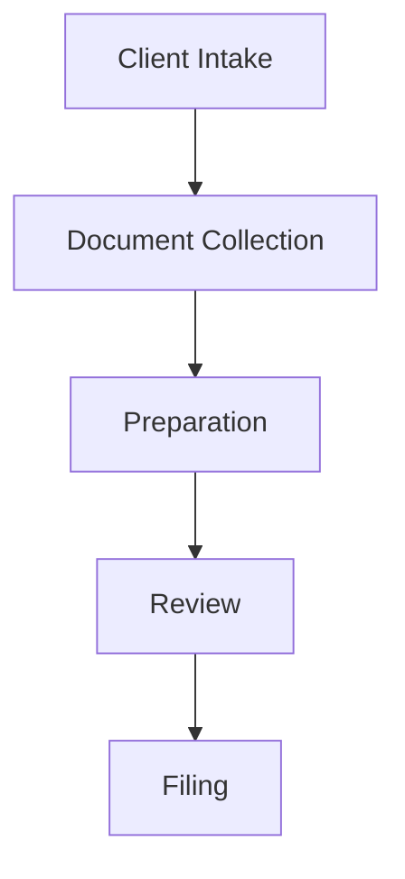

# Tax Return Workflow Diagram

## Overview
This document provides a visual representation of the tax return workflow stages and their relationships.

## Workflow Stages

## Stage Details

### 1. Client Intake
- Initial consultation
- Engagement letter signing
- Client information collection
- Entry Criteria: New client request received
- Exit Criteria: Engagement letter signed, client information collected

### 2. Document Collection
- W-2s, 1099s, receipts collection
- Document tracking system
- Missing document reminders
- Entry Criteria: Engagement process complete
- Exit Criteria: All required documents received and verified

### 3. Preparation
- Data entry
- Tax calculations
- Deductions/credits application
- Initial return generation
- Entry Criteria: All documents received
- Exit Criteria: Initial tax return prepared

### 4. Review
- Quality review
- Client approval process
- Error correction
- Entry Criteria: Initial return prepared
- Exit Criteria: Return approved by both internal review and client

### 5. Filing
- E-filing submission
- Confirmation tracking
- Post-filing documentation
- Entry Criteria: Approved return
- Exit Criteria: Successful e-filing confirmation received